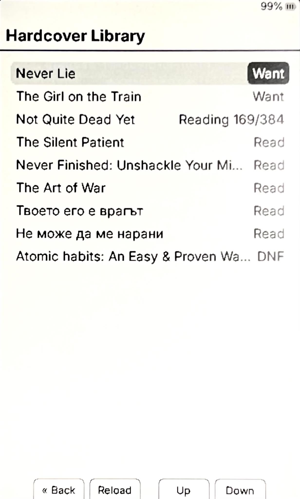
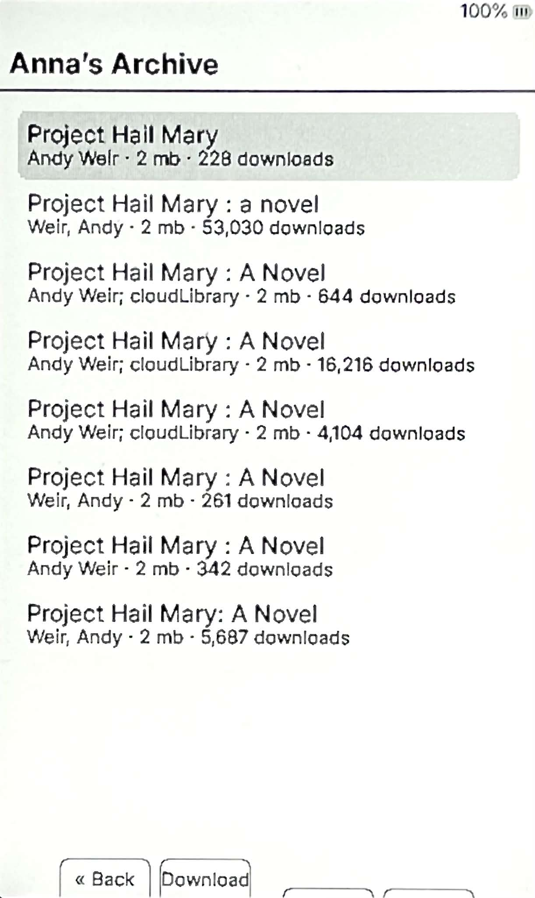

# CrossCover

CrossCover is a personal firmware fork based on [CrossInk](https://github.com/uxjulia/CrossInk) for the Xteink X4.

CrossCover adds Hardcover integration and Anna's Archive search and download support
while retaining the CrossInk reader foundation.

Current release: `1.5.0-crosscover.1`
Based on CrossInk: `1.5.0`

## Screenshots

<p align="center">
  
  
  
</p>

## ⚠️ Important hardware warning

CrossCover is intended for the Xteink X3 and X4.

Do not flash CrossCover on:

- Any device other than an Xteink X3 or X4
- A USB-locked Xteink device

## CrossCover additions

### Hardcover integration

- Import a Hardcover API key from the SD card
- Authenticate with Hardcover
- Link an EPUB manually by Book ID or ISBN
- Search for a matching Hardcover book automatically
- Mark a linked book as currently reading
- Mark a linked book as read
- Queue reading-progress updates
- Process pending updates from the Hardcover Library
- Rate a linked book
- View a lightweight Hardcover library screen

Hardcover actions are user-triggered. CrossCover does not run a background sync task or send page-by-page API updates.

### Anna’s Archive integration

- Open Anna’s Archive from `Home → CrossCover → Anna’s Archive`
- Search books directly from the device
- Display title, author, file size, and download count
- Download books directly to the SD card
- Choose the download folder from `Settings → System → Anna’s Archive Download Folder`
- Use a lightweight relay so the device receives only compact search results

Use the feature only for books you are legally allowed to access or download.

## Hardcover setup

1. Create a Hardcover API key.
2. Create this file on the SD card:

   ```text
   /.crosspoint/hardcover_token.txt
   ```

3. Put only the API key in the file.
4. Insert the SD card and boot the device.
5. Open:

   ```text
   Settings → System → Hardcover → Import API Key
   ```

6. Choose `Authenticate`.

## Linking a book to Hardcover

Inside an EPUB, open the reader menu and choose `Hardcover`.

Available actions include:

- `Link Book ID`
- `Find Automatically`
- `Mark Currently Reading`
- `Update Progress`
- `Mark Read`
- `Rate`

Automatic matching searches using the EPUB title and author. Manual Book ID or ISBN linking is safer when accuracy is important.

## Functionality inherited from CrossInk

The following functionality comes from the [CrossInk](https://github.com/uxjulia/CrossInk):

- EPUB reading support
- Chapter navigation
- Footnotes
- Bookmarks and clippings
- Reading statistics
- Custom fonts
- Reader layout and typography settings
- Offline dictionary lookup and dictionary management
- Auto page turn
- WiFi and file-transfer functionality
- Themes
- Firmware update and device-management functionality
- Other reader, storage, and system functionality provided by CrossInk

For the complete upstream feature list and documentation, see the [CrossInk repository](https://github.com/uxjulia/CrossInk).

## Flashing

Only flash CrossCover on a supported, non-USB-locked Xteink X3 or X4.

Before flashing, verify:

- The device is definitely an Xteink X3 or X4.
- The device is not USB-locked.
- The firmware file matches the intended build.
- Important SD-card files are backed up.

## Versioning

CrossCover follows the upstream CrossInk version and adds a fork-specific suffix.

Example:

```text
1.5.0-crosscover.1
```

This means CrossCover release `1` based on CrossInk `1.5.0`.

When CrossInk releases `1.5.1`, a corresponding CrossCover release may be named:

```text
1.5.1-crosscover.1
```

CrossCover is an independent personal fork and is not an official CrossInk release.

## Known limitations

- Xteink X3 and X4 only
- USB-locked devices must not be flashed with CrossCover
- Automatic Hardcover matching can select an incorrect book
- Hardcover progress updates are queued, but separate Hardcover reading sessions are not recorded
- IPA symbols may use readable approximations when the required glyph is not available in the firmware font
- Search availability depends on the relay and upstream mirrors
- The current search flow is limited to EPUB results
- Downloads may fail when all upstream mirrors are unavailable

## Credits

CrossCover is based on the [CrossInk](https://github.com/uxjulia/CrossInk) firmware project.

The Hardcover integration was informed by the Hardcover API documentation, KOReader Hardcover integration, and NickelHardcover.

CrossCover is developed independently and is not an official CrossInk project.

AI assistance was used during development for code inspection, API debugging, feature design, and documentation.

## Support

If you find a CrossCover-specific bug or have a feature request, open an issue in this repository.

For functionality inherited from CrossInk, consult the upstream [CrossInk repository](https://github.com/uxjulia/CrossInk).

If you would like to support development:

[](https://ko-fi.com/E3M5210X5J)
